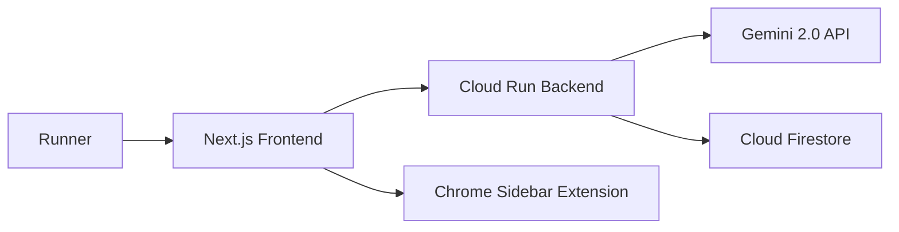

# 🏃‍♂️ ZUBORUNNER

### ずぼらなランナーに捧げる、戦略的マラソン特科アーカイブ

## 📝 プロジェクト概要

**ZUBORUNNER** は、マラソン完走証から「タイム」以上の価値を抽出する、知的財産アプローチに基づいたランニング管理プラットフォームです。
「ずぼら」な管理を肯定しながら、AI (Gemini 2.0) による自動補完と、Chrome 拡張機能による「実戦的データ参照」を組み合わせ、次戦の「勝ちパターン」を導き出します。

---

## 💡 今日の「戦略的」アップデート

本日の開発では、単なる記録の蓄積から**「データの武器化」**に焦点を当てた 2 つの機能を実装しました。

### 1. ブラウザ拡張機能：エントリー直結型「サイドパネル」

* **実装**: Chrome Side Panel API を活用した常駐型インターフェース。
* **戦略的価値**: RUNNET 等のエントリー画面のすぐ横で、過去のベストタイムや「コース特性ごとの相性」を確認可能。別タブを探し回るストレスを排除し、正確な目標タイム申告を支援します。

### 2. 知的資産の「統計的視覚化」

* **実装**: シューズ別の走行回数・ベストタイムの自動集計アルゴリズム。
* **戦略的価値**: 「どのブランドのシューズが自分にとって最もパフォーマンスが高いか」を数値で可視化。感覚に頼らない、データ駆動型の装備選定（Gear Selection Strategy）を実現しました。

---

## 🔥 主な機能

* **AI 完走証解析**: 画像/PDF から記録を自動抽出。
* **データ補完エージェント**: 大会名から「コースの起伏」「気象条件」を Gemini が推論。
* **3D タクティカル・ログ**: 「シューズ」「補給食」「コメント」に特化した入力インターフェース。
* **履歴からの再編集**: 過去の全記録をいつでも修正・更新可能な整合性設計。

---

## 🏗 システムアーキテクチャ

## 🛠 技術スタック

| Category | Technology |
| --- | --- |
| **Frontend** | Next.js (App Router), Tailwind CSS |
| **Backend** | Python (Flask/FastAPI), Cloud Run |
| **AI** | Gemini 2.0 Flash-exp (OCR & Analysis) |
| **Database** | Firebase Firestore |
| **Auth** | Firebase Authentication (Google Login) |

---

## 📅 ロードマップ

* **2026年 2月**: 統計データのグラフ化（年次推移）の実装。
* **2026年 5月**: **奈良ウルトラマラソン** 完走に向けた予測モデルの構築。

---

### 🛡️ 知財保護に関する注記

本プロジェクトは、個人情報の秘匿化（常夏冬太郎への置換）および環境変数（`.env.local`）による機密情報の保護を徹底しています。
